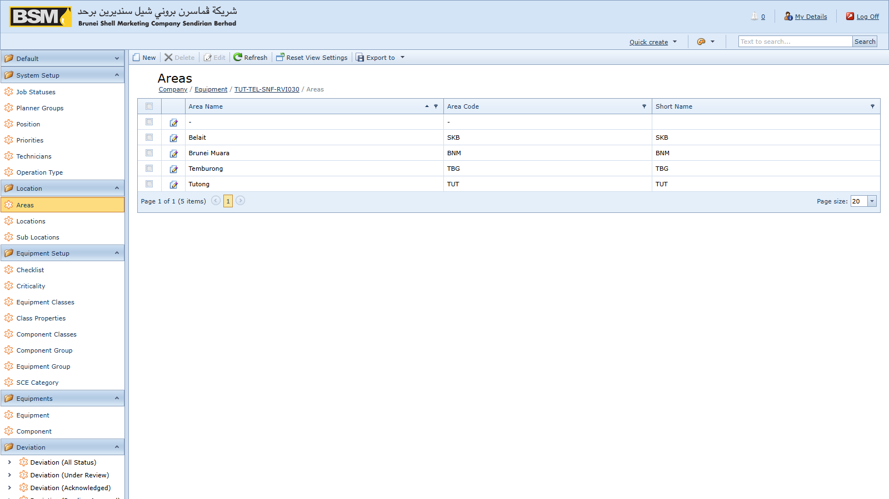
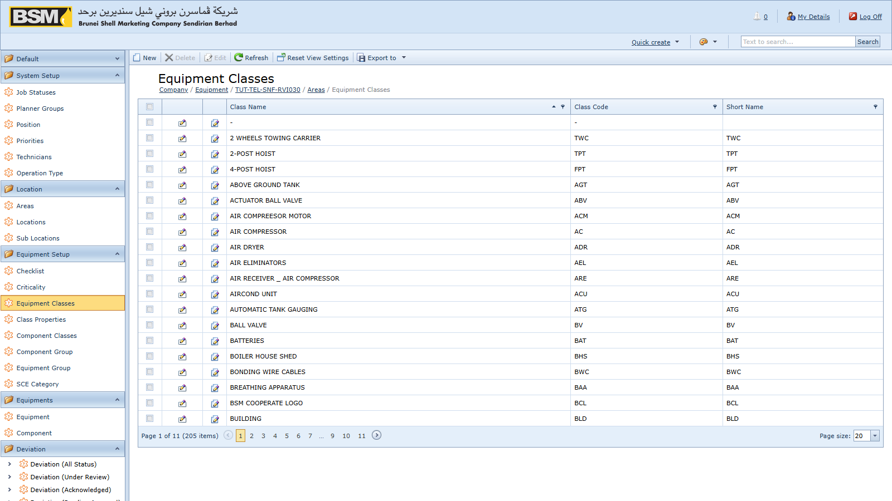
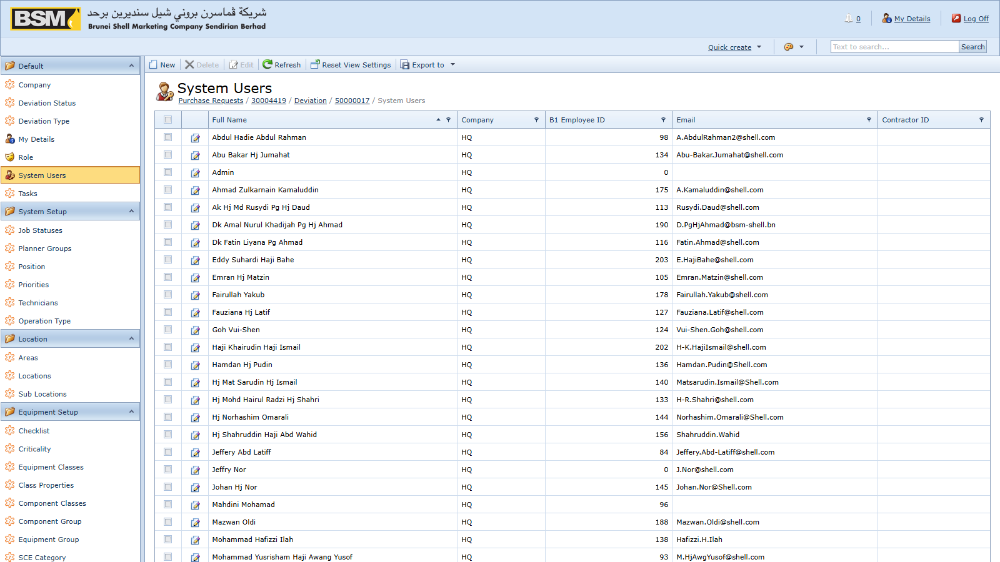
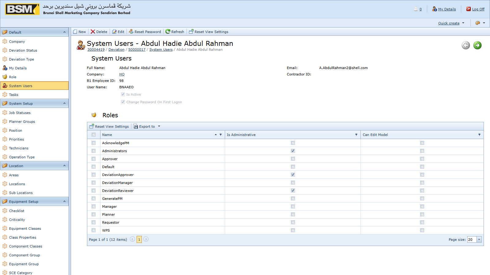
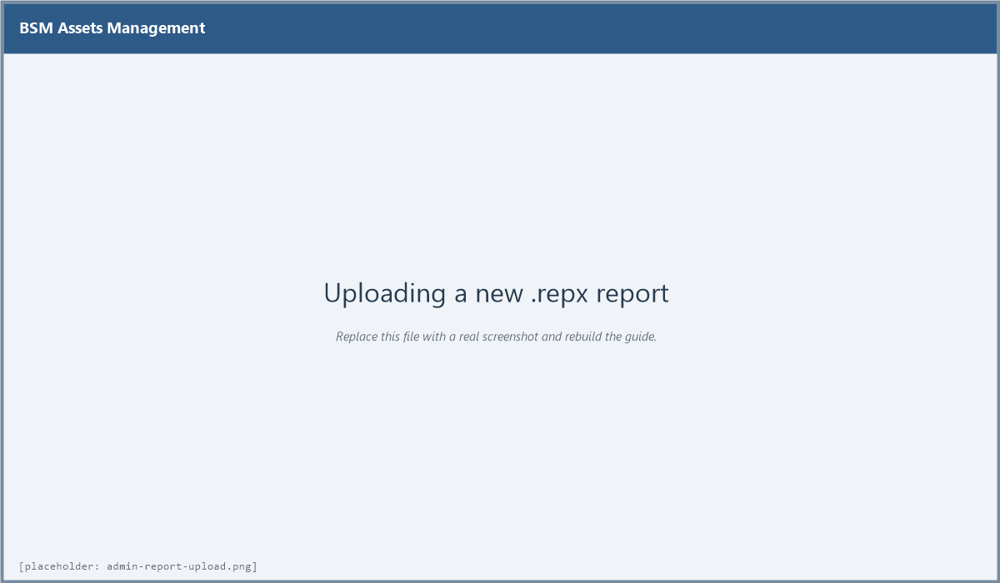
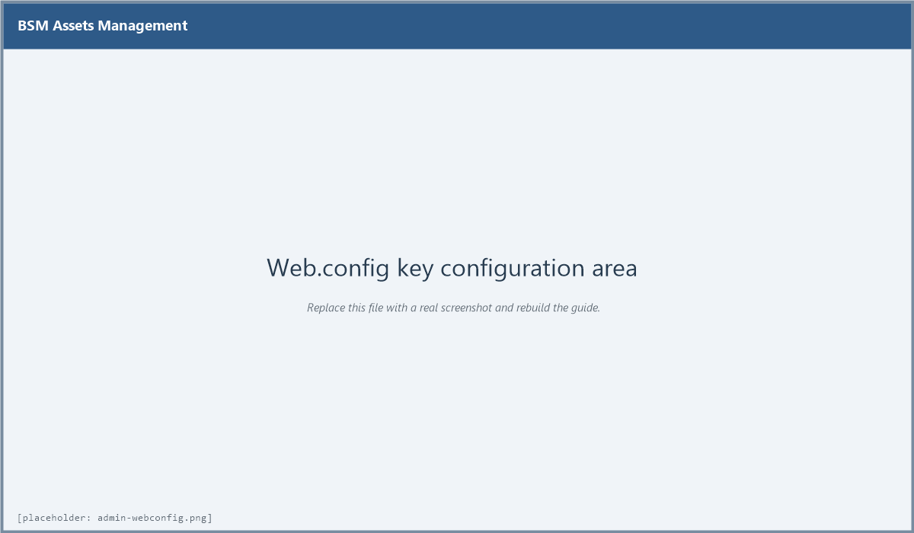

# Assets Management System — Administrator Guide

BSM Assets Management (AMS) — for system administrators and master-data owners


---

## 1. Introduction

### 1.1 About this guide

This guide is for **administrators** and **master-data owners** of the BSM Assets Management System (AMS). It covers setting up master data, managing users and roles, uploading reports, configuring SAP B1 integration, applying database updates and operating the workflow service. Day-to-day transactional use of the system is covered in the separate **End-User Guide**.

### 1.2 What an administrator does

Typical administrative responsibilities:

- Populating and maintaining master data (locations, equipment classes, PM setup, deviation setup, contractors, items, priorities, job statuses)
- Creating user accounts and assigning roles
- Uploading and updating `.repx` reports
- Configuring SAP B1 posting, email, and other settings in `Web.config`
- Applying database schema updates on deployment
- Operating the workflow server Windows service
- First-line troubleshooting

### 1.3 Platform overview

The AMS application is built on the DevExpress eXpressApp Framework (XAF) v17.1 against .NET Framework 4.5.2, using Entity Framework 6 against SQL Server. The solution is composed of:

- **AssetsManagementEF.Web** — the ASP.NET WebForms host users sign into
- **AssetsManagementEF.Win** — a WinForms desktop companion used for administrative tasks
- **AssetsManagementEF.Module / .Module.Web / .Module.Win** — business logic shared across both hosts
- **AssetsManagementEF.WorkflowServerService** — Windows Service that runs scheduled workflows

A deeper technical overview is in `CLAUDE.md` at the repository root.

---

## 2. Master data setup

Master data must be populated before transactions can be entered. This chapter covers each group in the order a new site would normally configure them.

### 2.1 Location hierarchy

Locations are organised as **Area → Location → Sub Location**. Every equipment record is attached to a Sub Location, so this hierarchy must exist first.



To create an Area:

1. Navigate to **Location → Areas** and click **New**.
2. Enter the **Code** and **Name**.
3. **Save and Close**.

Then create **Locations** (with the parent Area) and **Sub Locations** (with the parent Location). Use short stable codes — codes are referenced throughout the database and are hard to change later.

### 2.2 Equipment classification

Set up the classification tables under **Equipment Setup** before registering equipment:



- **Equipment Classes** — the asset type (Pump, Compressor, Tank, etc.). Classes can carry documents and properties that inherit onto every equipment record of that class.
- **Equipment Groups** — used for reporting groupings.
- **Component Classes** and **Component Groups** — the equivalents for components fitted to equipment.
- **Class Properties** — specification fields inherited onto each equipment of the class.
- **Criticalities** — the criticality rating (commonly A / B / C).
- **Check Lists** — reusable inspection checklists attachable to PM Schedules.
- **SCE Categories** — Safety Critical Element categories used when flagging equipment as SCE.

### 2.3 People and organisations

Under **System Setup** and **Setup**:


- **Positions** — job titles (Operator, Engineer, Planner, etc.).
- **Technicians** — technicians available to be assigned to work orders.
- **Planner Groups** — groups of planners used for routing WRs and POs.
- **Companies** — internal companies, facilities, terminals and retail outlets. The default `HQ` company code is reserved for head office.
- **Contractors** — external contractors, optionally linked to a contract.
- **Contract Documents** — the contract under which a contractor is engaged, with start and end dates. Contract dates are enforced when raising PRs against the contract.

### 2.4 Catalogue

Under **Setup** and **System Setup**:

- **Item Masters** — the list of stock items and services that may appear on PRs. Item codes here must match SAP B1 item codes if PR posting to SAP is enabled.
- **Priorities** — priority levels for WRs and WOs.
- **Work Order Operation Types** — the nature of an operation line on a work order.

### 2.5 Job Statuses


Job Statuses define the execution status codes a Work Order passes through. The three codes the application treats specially are:

- **AP** — initial CM job status (Awaiting Planning)
- **AA** — initial PM job status (Awaiting Assignment)
- **TC** — closure status (Technical Completion)

These three must exist. You may add any number of intermediate statuses at your site (for example *In Progress*, *On Hold*, *Waiting Parts*). Intermediate codes are free-form but should remain stable once transactions have been recorded against them.

### 2.6 Document Types

The internal **DocTypes** table is seeded automatically on startup by the `ModuleUpdater` with the codes `PM`, `CM`, `PR`, `WR` and `DE`. You should not need to modify this table manually.

### 2.7 PM Schedule setup

Before schedules can be created, the supporting data under **PM Schedule Setup** must exist:

- **PM Classes** — classification of PM activities
- **PM Departments** — the department owning the PM
- **PM Frequencies** — the interval (Daily, Weekly, Monthly, Quarterly, Annual, etc.)

### 2.8 Deviation setup

Reference data under **Deviation Setup**:

- **Discipline** — Mechanical, Electrical, Instrumentation, HSE, etc.
- **Frequencies** — the deviation review frequency
- **Locations** — location classifications for deviations
- **Risk Assets / People / Environment / Community** — the risk lookup tables referenced by the Risk Assessment section of a Deviation
- **Risks** — the consolidated risk catalogue

And under **Setup**:

- **Deviation WO Types** — Work Order types that require a deviation to be linked at save time
- **Deviation WR Types** — Work Request types that require a deviation

### 2.9 Good master-data hygiene

- **Use short stable codes.** Codes are referenced throughout the database and are hard to change after transactions exist.
- **Do not delete** master records that have been referenced by transactions — the system will block it. Flag them as inactive if your site's setup supports it, or leave them untouched.
- **Review classifications with business owners before go-live.** Renaming an Equipment Class after 10,000 equipment records exist is cosmetic only; merging or splitting classes later requires a data migration.
- **Changes to Job Statuses are sensitive.** Never delete `AP`, `AA` or `TC` — the application uses their codes in business rules.

---

## 3. User and role administration

### 3.1 Where users are managed

User accounts are managed by users with the **Administrators** role. Open the Admin navigation group and go to **Users**.



### 3.2 Creating a user

1. Click **New**.
2. Enter a unique **User Name** and an initial **password**.
3. Set **Change Password On First Logon** if you want the user to reset the password at first sign-in.
4. Add the required **Roles** on the **Roles** tab.
5. Optionally link the user to a **Technician**, **Contractor** or **Position** record.
6. **Save and Close**.



### 3.3 Roles reference

The following roles are recognised by the application code. Assign them based on duties.

**Operational roles**

- **Administrators** — full access. Grant sparingly.
- **Manager** — manager-level review and reporting
- **Approver** — approves Work Requests and Work Orders
- **Planner** — plans Work Orders, converts WRs to WOs
- **Supervisor** — supervises execution
- **Technician** — executes Work Orders
- **Requestor** — raises Work Requests
- **Contractor** — external contractor user, view-limited
- **WRSupervisor** — supervisor over Work Request review
- **WPS** — WPS-domain user
- **GeneratePM** — generates PM Work Orders from schedules
- **AcknowledgePM** — acknowledges generated PMs

**Action-scoped roles**

- **PostPR** — posts Purchase Requests to SAP B1
- **CancelPRRole** / **CancelWRRole** / **CancelWORole** — cancel PRs, WRs, WOs respectively
- **WOPlanDateRole** — sets the Plan Date on Work Orders

**Deviation roles**

- **DeviationUser** — creates and edits deviations in Draft
- **DeviationReviewer** — reviews and acknowledges deviations
- **DeviationManager** — manages the deviations portfolio and submits for approval
- **DeviationApprover** — approves deviations
- **DeviationReopen** — re-opens a Closed deviation

### 3.4 Role design guidance

- **Grant Administrators sparingly.** It bypasses most permission checks. Operational staff should not hold it.
- **Use action-scoped roles for sensitive actions.** For example, `PostPR` should only be on Finance or Procurement staff; `WOPlanDateRole` should only be on Planners.
- **Split duties for Deviations.** `DeviationUser`, `DeviationReviewer` and `DeviationApprover` should be on different people to preserve the control.
- **Audit periodically.** Review the user list at least quarterly and disable accounts for people who have left.

### 3.5 Disabling a user

Open the user and uncheck **Is Active** (or equivalent at your site configuration), then Save. The user's historical documents remain, but they cannot sign in. Do not delete user records — deletions break attribution of past documents.

### 3.6 Passwords

- Password policy is enforced by the underlying XAF security system. If your site customises the policy, it is done in code — contact development.
- To reset a password, open the user and clear/set the password field. The user will sign in with the new password.

---

## 4. Report management

### 4.1 Reports overview

Reports are DevExpress `.repx` files. They are stored in the database (in the `ReportDataV2` table) rather than on disk, so copying a `.repx` to a folder on the server is **not** sufficient — it must be uploaded through the admin UI.

### 4.2 Where reports live in the repository

For reference and version-control purposes, current and historical `.repx` files are stored in the repository at:

- `Reports/` — the main operational reports
- `ReportsNew/` — replacements pending deployment
- `Reports Deviation/` — deviation-related reports
- `Reports Deviation Backup/` — archived deviation reports

When you receive an updated `.repx` from development, place it in the appropriate folder and commit, then upload it into the running environment via the steps below.

### 4.3 Uploading a new report

1. Sign in as an Administrator.
2. Navigate to the Report Data admin view.
3. Click **New**, enter a display name matching the filename, and upload the `.repx`.



4. **Save and Close**. The new report immediately appears in the **Reports** navigation group for all users with access.

### 4.4 Updating an existing report

1. Open the existing report entry in Report Data.
2. Replace the `.repx` via the upload control.
3. **Save**. The updated layout is used for subsequent runs.

Do not delete the existing report entry and re-create it — user bookmarks and any saved parameters are preserved if you update in place.

### 4.5 Built-in reports shipped

Current reports in the repository:

- All Work Order Documents
- All Work Request Documents
- All PM Patch Documents
- Bad Actor
- Weekly AMS Measures
- IA / ME Monthly KPI Measures
- Facility / Retail / Terminal Current AMS Measures
- Facility / Retail / Terminal ME Status Report / ME Monthly KPI Measures
- Facility / Retail / Terminal SCE Status Report / SCE Monthly KPI Measures
- RETAIL / TERMINAL SCE Deviation LAFD Status Report
- Deviation Layout
- All SCE Monthly KPI Measures

---

## 5. Configuration

### 5.1 Where configuration lives

Server-side configuration is in `Web.config` at the root of the deployed web application. After any change you must recycle the IIS application pool for the change to take effect.



### 5.2 Connection string

```
<connectionStrings>
  <add name="ConnectionString"
       connectionString="MultipleActiveResultSets=True;Data Source=SERVER\INSTANCE;Initial Catalog=AssetsManagementEF;User Id=...;Password=..."
       providerName="System.Data.SqlClient" />
</connectionStrings>
```

The name must remain **`ConnectionString`** — this is hard-coded into the DbContext.

### 5.3 Email settings

Under `appSettings`:

- **EmailSend** — `Y` to enable outbound email notifications
- **EmailHost** — SMTP server host name
- **EmailPort** — SMTP port (typically 25 or 587)
- **Email** — the From address
- **EmailPassword** — the SMTP account password (blank if `EmailUseDefaultCredential` is `Y`)
- **EmailName** — the From display name
- **EmailSSL** — `Y` to use SSL/TLS
- **EmailUseDefaultCredential** — `Y` to use the service account's Windows credentials

### 5.4 SAP B1 settings

Under `appSettings`:

- **B1Post** — `Y` to enable PR posting to SAP B1
- **B1Server** — SAP server name
- **B1CompanyDB** — SAP company database (e.g. `BSM_LIVE`)
- **B1UserName / B1Password** — SAP user
- **B1Sld** — SAP Service Layer endpoint (e.g. `SERVER:40000`)
- **B1License** — SAP license server
- **B1DbServerType** — the SQL flavour (e.g. `dst_MSSQL2019`)
- **B1DbUserName / B1DbPassword** — the SQL credentials used by SAP
- **B1Language** — SAP UI language (e.g. `ln_English`)
- **B1PRseries** — the integer series number for Purchase Request documents in SAP
- **B1AttachmentPath** — filesystem folder where AMS copies PR attachments for SAP

User-defined field names for AMS traceability on SAP PRs:

- **B1PRCol** — the flag UDF indicating the PR came from AMS (commonly `U_FT_AMS_PR`)
- **B1PRNoCol** — the AMS PR number (commonly `U_FT_AMS_PRNo`)
- **B1WONoCol** — the AMS WO number (commonly `U_FT_AMS_WONo`)
- **B1PRLineIDCol** — the AMS PR line ID (commonly `U_FT_AMS_PRLINEID`)
- **B1CTCol / B1CTNoCol** — contract UDFs (commonly `U_Contract`, `U_ContractNo`)

### 5.5 Error and trace settings

Under `appSettings`:

- **SimpleErrorReportPage** / **RichErrorReportPage** — URLs shown on unhandled errors (default `Error.aspx`)
- **EnableDiagnosticActions** — `True` exposes extra diagnostic actions to administrators (leave `False` in production)

Under `<system.diagnostics>`:

- **eXpressAppFramework** — trace level: `0` Off, `1` Errors, `2` Warnings, `3` Info (default), `4` Verbose. The log file is `eXpressAppFramework.log` in the web application folder.

### 5.6 Authentication

The web app uses Forms authentication with a 10-minute timeout:

```
<authentication mode="Forms">
  <forms name="Login" loginUrl="Login.aspx" path="/" timeout="10" />
</authentication>
```

Anonymous access is granted only to `DXX.axd`, `Error.aspx` and the `Images` folder. Preserve those `<location>` exceptions if you make `Web.config` edits.

### 5.7 Protecting credentials

`Web.config` contains SQL, SMTP and SAP credentials. Protect it:

- Restrict NTFS ACLs on the deployment folder so only the IIS account and administrators can read it.
- Do not commit production `Web.config` values to source control. Keep production credentials in a separately-managed configuration kept out of Git.
- Consider using `aspnet_regiis -pe` to encrypt the `connectionStrings` and `appSettings` sections at rest.

---

## 6. Database updates

### 6.1 Two-stage update

Schema changes are applied in two stages whenever the application starts against a database with an older schema version:

1. **Entity Framework migrations** — the timestamped migrations under `AssetsManagementEF.Module/Migrations/` are applied to bring the schema up to date.
2. **Module Updater seed step** — `AssetsManagementEF.Module/DatabaseUpdate/Updater.cs` then runs and inserts any missing reference rows (document types, default roles, and similar).

### 6.2 Debug vs release behaviour

When the host application is running a debugger (Debug configuration), the schema is updated automatically on startup. In Release (production) the administrator should apply the migration explicitly to retain control over the window in which the update happens.

### 6.3 Deployment checklist

Before deploying a new version:

1. **Back up** the SQL Server database. This is non-negotiable.
2. Deploy the updated binaries to a staging IIS site first and verify startup.
3. Review the new EF migrations under `AssetsManagementEF.Module/Migrations/` and the `Updater.cs` diff.
4. Apply to production during a maintenance window.
5. Take application-pool recycle logs and the first minute of `eXpressAppFramework.log` to confirm a clean start.

### 6.4 Ad-hoc SQL patches

Under the repository's `SQL/<YYYYMMDD>/` folders are ad-hoc SQL scripts that have historically been applied to production databases outside the migration pipeline. These are **records of what has been run**, not scripts that the application re-applies. When applying a new ad-hoc script:

- File it under a new `SQL/<YYYYMMDD>/` folder.
- Include a comment header stating the reason and the affected environments.
- Commit it even if it only runs once.

### 6.5 Rolling back

There is no automated rollback for EF migrations in this product. A schema rollback is a manual restore from the backup taken in step 1 of the deployment checklist. Test the restore path on staging before you need it in production.

---

## 7. Workflow server service

### 7.1 What it does

The **AssetsManagementEF.WorkflowServerService** is a Windows Service that hosts the XAF Workflow Server. It runs background workflows such as notifications, scheduled tasks and status-driven side effects that should not depend on a user having a browser session open.

### 7.2 Installation

Detailed installation instructions are in `Install WorkflowServiceServer.docx` at the root of the repository. The short version:

1. Build the solution in **Release** configuration.
2. Copy the service binaries from `AssetsManagementEF.WorkflowServerService/bin/Release/` to the target server.
3. Register the service using `installutil` (or the project's built-in `ProjectInstaller`).
4. Configure the service's `App.config` `ConnectionString` to point at the same SQL database as the web app.
5. Start the service and confirm it appears in `services.msc` as Running.

### 7.3 Configuration

The service reads the same `ConnectionString` and `B1*` settings as the web app, from its own `App.config`. Keep the two in sync — if the web app connects to one database and the workflow service to another, scheduled actions will be invisible to users.

### 7.4 Operating

- **Starting / stopping:** use `services.msc` or `sc` on the server.
- **Logging:** the service writes to the Windows Event Log under *Applications* with source name matching the service, and also to the workflow server log file in its working directory.
- **Account:** the service runs under the Local System account by default. If you need to access network paths (for example for attachments on a file share), change the account to a domain service account.

### 7.5 Troubleshooting

- **Service starts then stops:** almost always a connection string or credential problem. Check the Event Log for the first error after startup.
- **Workflows do not fire:** check that the workflow definitions are published in the database and that the service is Running. The service polls the database on a short interval.
- **Duplicate runs:** never run two instances of the service against the same database.

---

## 8. Troubleshooting

### 8.1 Application log

`eXpressAppFramework.log` in the web application folder is the first place to look. The trace level is controlled by the `eXpressAppFramework` switch in `Web.config`.

### 8.2 Common issues

- **"Cannot Delete" message** — delete is intentionally blocked on Equipment, Work Orders, Work Requests, PM Schedules and Deviations. Use Cancel or Withdraw.
- **Report does not appear** — confirm the `.repx` has been uploaded via the admin UI, not just copied to disk.
- **Date shows in the wrong format** — the web app forces `dd/MM/yyyy`. Do not change the browser regional settings.
- **Login succeeds but no menus** — the user has no roles assigned. Open the user record and add roles.
- **"Cannot save" due to deviation flags** — the WO or WR has both "approved deviation" and "no deviation needed" flags set. Clear one.
- **PR post to SAP fails** — check the SAP B1 settings, that the SAP service is reachable, that `B1PRseries` matches an existing active series and that the SAP user has permission to create PRs.

### 8.3 Collecting diagnostics for a support ticket

If a user reports an issue:

1. Ask for the Doc Num of the affected document.
2. Ask for the exact error message or a screenshot.
3. Take the last ~500 lines of `eXpressAppFramework.log`.
4. Record the user's user name and the time the error occurred.
5. Note any recent changes (new report uploaded, `Web.config` edited, new deployment).

### 8.4 Recovering from a corrupted Application Model

The XAF Application Model is stored in the `ModelDifference` tables. If a bad model difference breaks the UI for all users:

1. Sign in as an Administrator to the WinForms application (it uses the same database but a different Model).
2. Open the Model Difference editor and remove or revert the bad difference.
3. Ask users to refresh their browser.

If the WinForms app is also broken, the Model Difference rows can be deleted directly in SQL Server, with a backup taken first. Deleted rows revert all users to the default model shipped with the code.

---

## 9. Reference tables

### 9.1 Document type codes

| Code | Meaning            |
|------|--------------------|
| PM   | Preventive WO      |
| CM   | Corrective WO      |
| WR   | Work Request       |
| PR   | Purchase Request   |
| DE   | Deviation          |

### 9.2 Job status codes

| Code | Meaning                          |
|------|----------------------------------|
| AP   | Awaiting Planning (initial CM)   |
| AA   | Awaiting Assignment (initial PM) |
| TC   | Technical Completion (closure)   |

Additional codes are free-form and site-defined.

### 9.3 Equipment status values

| Value | Meaning                  |
|-------|--------------------------|
| UP    | Equipment available      |
| DOWN  | Equipment offline        |

### 9.4 Deviation status values

New, Draft, Under Review, Submit Acknowledge, Pending Approval, Approved, Open, Expired, Draft Extension, Approved Extension, Withdrawn, Closed, Cancel.

### 9.5 Deviation types

OLAFD, SCE.

### 9.6 All role names recognised by the code

Administrators, Manager, Approver, Planner, WPS, Supervisor, Technician, Requestor, Contractor, WRSupervisor, GeneratePM, AcknowledgePM, PostPR, CancelPRRole, CancelWRRole, CancelWORole, WOPlanDateRole, DeviationUser, DeviationManager, DeviationApprover, DeviationReopen, DeviationReviewer.

---

*End of Administrator Guide.*
