# Assets Management System — End-User Guide

BSM Assets Management (AMS) — for everyday users

---

## 1. Introduction

### 1.1 About this guide

This guide is for **everyday users** of the BSM Assets Management System (AMS) web application — the people who raise Work Requests, plan and execute Work Orders, raise Purchase Requests, and manage Deviations. If you set up master data, manage users or configure the system, please use the companion **Administrator Guide** instead.

### 1.2 What the system does

AMS is a Computerised Maintenance Management System (CMMS) that keeps track of:

- All registered **equipment** across your facilities, retail outlets and terminals
- **Preventive maintenance (PM)** schedules and the work orders they generate
- **Corrective maintenance (CM)** work orders raised from ad-hoc work requests
- **Purchase requests (PR)** for spare parts and services, with posting to SAP Business One
- **Deviations** (OLAFD and SCE) and their approval workflow

### 1.3 Document codes used throughout the system

Every transactional document carries a two-letter code in its header:

- **PM** — Preventive Work Order
- **CM** — Corrective (Breakdown) Work Order
- **WR** — Work Request
- **PR** — Purchase Request
- **DE** — Deviation

---

## 2. Logging on

### 2.1 Opening the application

Open a supported web browser and go to the AMS URL provided by your administrator. The sign-in page is displayed.

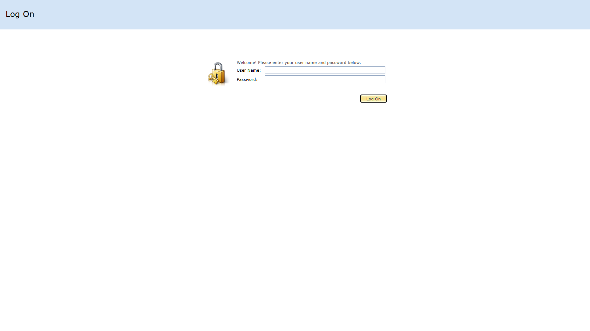

### 2.2 Signing in

Enter your **User Name** and **Password**, then click **Log On**. Usernames are case-insensitive. You cannot self-register — if you do not have an account, contact your administrator.

> NOTE: Anonymous browsing is only allowed for the error page and static images. All business screens require sign-in.

### 2.3 First sign-in

If your administrator flagged your account for a password change, you will be prompted on first sign-in. Choose a strong password and keep it confidential — every document you create, approve or edit is tagged with your user name.

### 2.4 Signing out

Click **Log Off** on the toolbar, or simply close the browser tab. Your session will also end automatically after the configured inactivity timeout.

### 2.5 Forgotten password

There is no self-service password reset. Contact your administrator to have your password reset.

---

## 3. Navigating the application

### 3.1 Screen layout

After signing in, the screen is divided into three areas: the **Navigation pane** on the left, the **Main work area** in the centre, and the **Toolbar** at the top.

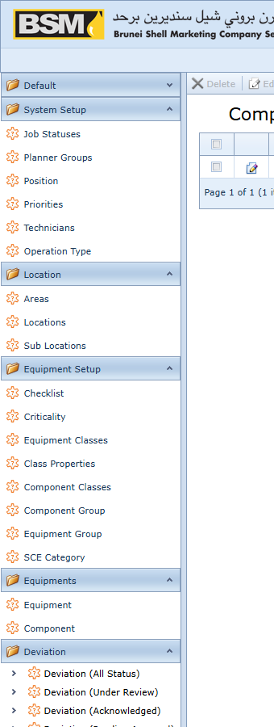

### 3.2 Navigation groups you will use

The menu groups relevant to everyday users:

- **Equipments** — find and view equipment records
- **Work Requests** — raise and track WRs
- **Work Orders** — plan and execute PM and CM WOs
- **Purchase Requests** — raise and post PRs
- **Deviation** — create and manage deviations
- **Reports** — run built-in KPI and status reports

Your administrator may hide some groups based on your role. If a menu you expect is missing, contact your administrator.

### 3.3 Working with list views

A list view shows many records in a grid.

Common actions on the list toolbar:

- **New** — create a new record
- **Edit** — open the highlighted record
- **Export** — save the grid as Excel, PDF, CSV, RTF or XML
- **Search** — full-text filter across all columns

You can also:

- Click a column header to sort
- Drag a column header to reorder
- Use the filter row below the header to filter by column value
- Right-click a column header for grouping and more options

Your layout, sort order and filters are remembered per user.

### 3.4 Working with detail views

A detail view shows one record across multiple tabs. Most transactional documents have a **Header**, a **Detail** tab (the line items), **Attachments** and **Photos** tabs, and a **Doc Status** history tab.

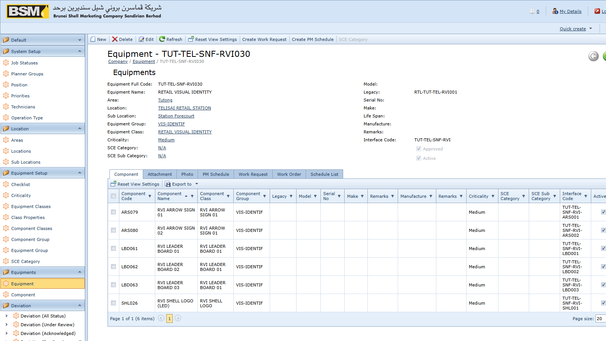

Red-asterisk fields are mandatory. Lookup fields accept free-text search — type a few characters and press **Tab** or pick from the drop-down.

### 3.5 Saving, cancelling and closing

- **Save** — commit and stay on the record
- **Save and Close** — commit and return to the list
- **Save and New** — commit and start a blank record of the same type
- **Close** — close without saving; unsaved changes are discarded after confirmation

> NOTE: In AMS, most transactional documents **cannot be deleted**. Use the **Cancel** or **Withdraw** action instead — this preserves the audit trail.

---

## 4. Finding equipment

### 4.1 Why this matters

Almost every transaction in AMS starts from an equipment record. Before raising a Work Request or reviewing a PM, you usually need to find the equipment first.

### 4.2 Opening the equipment list

Go to **Navigation → Equipments → Equipments**.

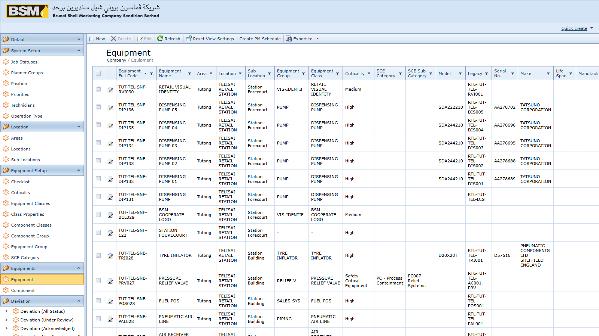

### 4.3 Searching for equipment

Use the **Search** box to full-text search by code, description or location. Alternatively, use the filter row to narrow by **Equipment Class**, **Location**, **Criticality** or **Status** (`UP` / `DOWN`).

### 4.4 Opening an equipment record

Double-click the row to open the detail view.

Key fields:

- **Full Code** — the auto-generated equipment identifier
- **Equipment Class** — the classification, driving property inheritance
- **Location / Sub Location** — physical location
- **Criticality** — A, B or C
- **Status** — `UP` (available) or `DOWN` (offline)
- **SCE flag** — marks a Safety Critical Element

Tabs under an equipment record:

- **Components** — sub-assemblies (motor, impeller, gearbox, etc.)
- **Properties** — specification values
- **Attachments** — certificates, manuals, drawings
- **Photos** — site and nameplate photos

From the equipment detail view you can jump straight to related PM schedules, open work requests and past work orders.

---

## 5. Preventive maintenance

### 5.1 How PM works in this system

Preventive maintenance is driven by **PM Schedules** that repeat at a defined frequency. When a PM comes due, an authorised user **generates** a PM Work Order from the schedule, and a second user **acknowledges** the generated PM. After acknowledgement the PM Work Order is just like any other work order.

### 5.2 Viewing a PM Schedule

Go to **Navigation → PM Schedule Setup → PM Schedules** and open a schedule.

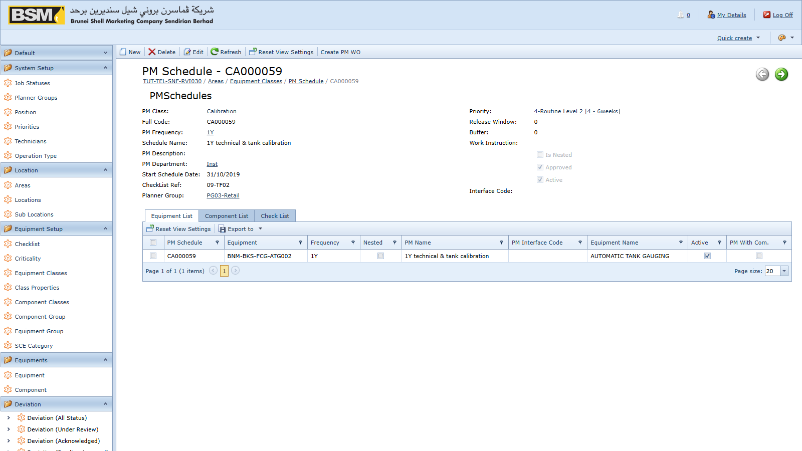

Key fields on a PM Schedule:

- **Full Code** — the auto-generated schedule identifier
- **PM Class, PM Department, PM Frequency** — classification and cadence
- **Equipment** (Detail tab) or **Component** (Components tab) — what gets maintained
- **Check Lists** — inspection steps to follow
- **Due date** — the next date this schedule is due

### 5.3 Generating PM Work Orders

If you have the **GeneratePM** role, you can create the work orders from schedules:

1. Open **PM Schedules** or the relevant **PM Patch** (a named batch of schedules generated together).
2. Select the schedule(s) to generate.
3. Click **Generate** on the toolbar.
4. The system creates a new Work Order with document type `PM`, copying the details from the schedule.

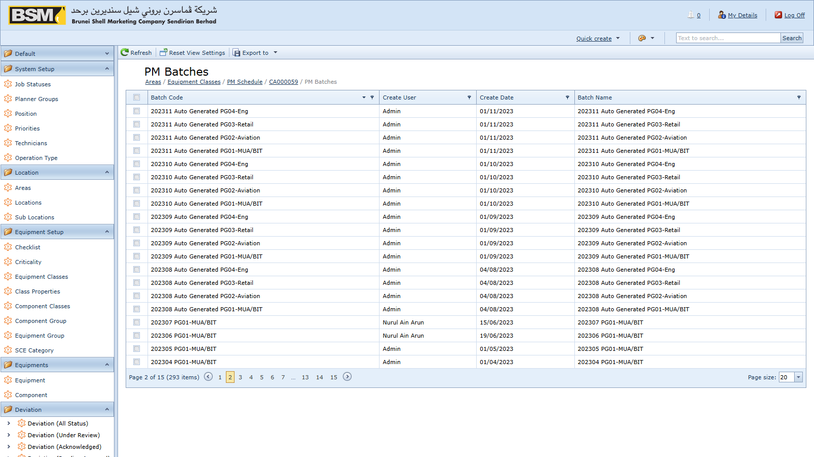

### 5.4 Acknowledging a generated PM

If you have the **AcknowledgePM** role, open the newly generated PM from the Work Orders list, review it, and click **Acknowledge**. The PM is then visible to planners.

### 5.5 Rescheduling or skipping

A schedule can be placed on hold or skipped from its detail view. Skipping records the reason and moves the schedule's next due date forward.

---

## 6. Work Requests

### 6.1 When to raise a Work Request

Raise a WR whenever someone observes a problem, need or improvement opportunity that requires maintenance and is **not** already covered by a PM Schedule. Typical examples:

- Equipment breakdown reports
- Minor repairs requested by operations
- Ad-hoc service requests

### 6.2 Creating a Work Request

1. Go to **Navigation → Work Requests → Work Requests** and click **New**.

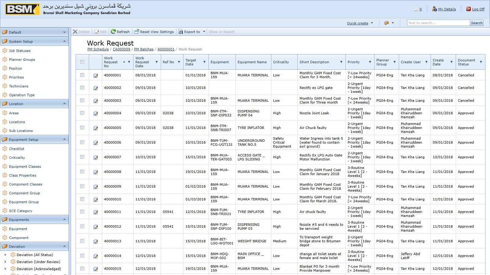

2. Select the **Company** (facility, terminal or retail outlet) and **Priority**.
3. Pick the **Equipment** or **Equipment Component** the WR concerns. At least one equipment or component line is required.
4. Fill in the **Long Description** and **Long Remarks** explaining the issue.
5. Attach photos under **Photos** and supporting documents under **Attachments**.
6. If the work is an MOC change that depends on an approved deviation, link it on the **Deviation** tab.
7. **Save**. The Doc Num is generated and the WR enters its initial status.

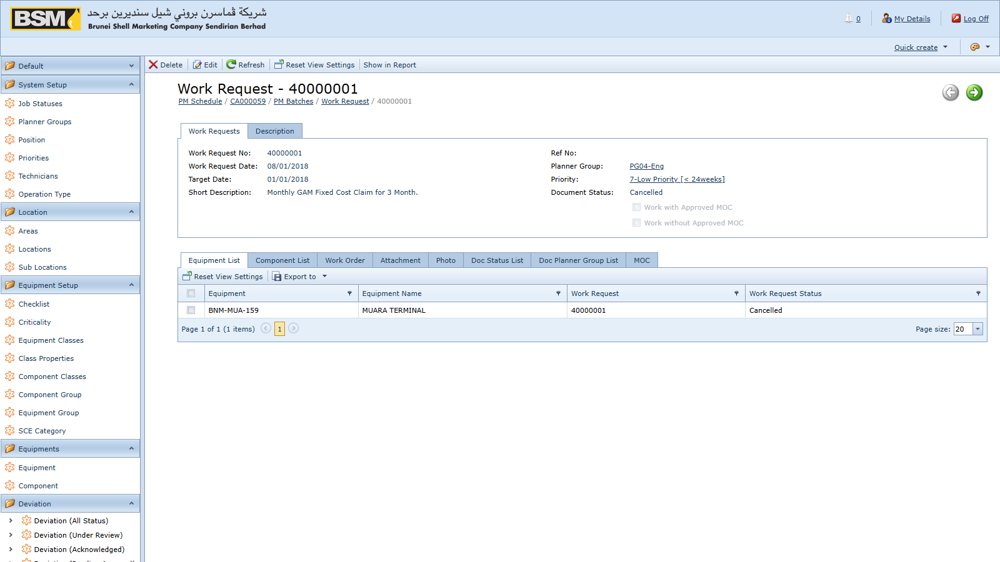

### 6.3 WR lifecycle

A Work Request typically flows through:

1. **Draft / Submitted** — created by the requestor
2. **Under Review** — a WR Supervisor or Planner reviews
3. **Approved** — ready for conversion to a Work Order
4. **Work Order Created** — one or more WOs linked back
5. **Closed** — all linked WOs are closed
6. **Cancelled** — cancelled before completion (requires **CancelWRRole**)

Every status change is recorded on the **Doc Status** tab of the WR.

### 6.4 Rules to be aware of

- A WR cannot be saved if it is flagged both as "approved deviation" and "no deviation needed" — these are mutually exclusive.
- A WR cannot be deleted. Use **Cancel** instead.
- Contractors cannot edit a WR while it is in the "contractor checking" state.

### 6.5 Converting to a Work Order

Once the WR has been approved, the Planner opens the WR and clicks **Create Work Order**. A new CM Work Order is created with equipment, description and attachments copied across, and linked back to the WR.

---

## 7. Work Orders

### 7.1 PM vs CM

Work Orders come in two types:

- **PM** — generated from a PM Schedule
- **CM** — raised from a Work Request

Both look the same on screen; the **DocType** field tells them apart.

### 7.2 The Work Order screen

Tabs on a Work Order:

- **Header** — numbering, dates, priority, planner group, company, source (WR or PM Schedule)
- **Detail** — equipment lines
- **Components** — component lines
- **Operations** — planned operation steps per equipment line
- **Component Operations** — operation steps per component line
- **Man Hours** — planned and actual man-hours by technician
- **Purchase Requests** — PRs raised from this WO (see Chapter 8)
- **Photos / Attachments** — supporting media and documents
- **Job Status** — the execution status history
- **Doc Status** — the document status history
- **Deviations** — linked deviations, if any
- **Long Description / Remarks** — free-text notes

### 7.3 Planning a Work Order

Once the WO exists, the Planner:

1. Reviews the **Detail** and **Components** tabs and adjusts as needed.
2. Assigns the **Planner Group**.
3. Plans each operation line under **Operations** / **Component Operations**.

4. Assigns technicians and planned hours under **Man Hours**.

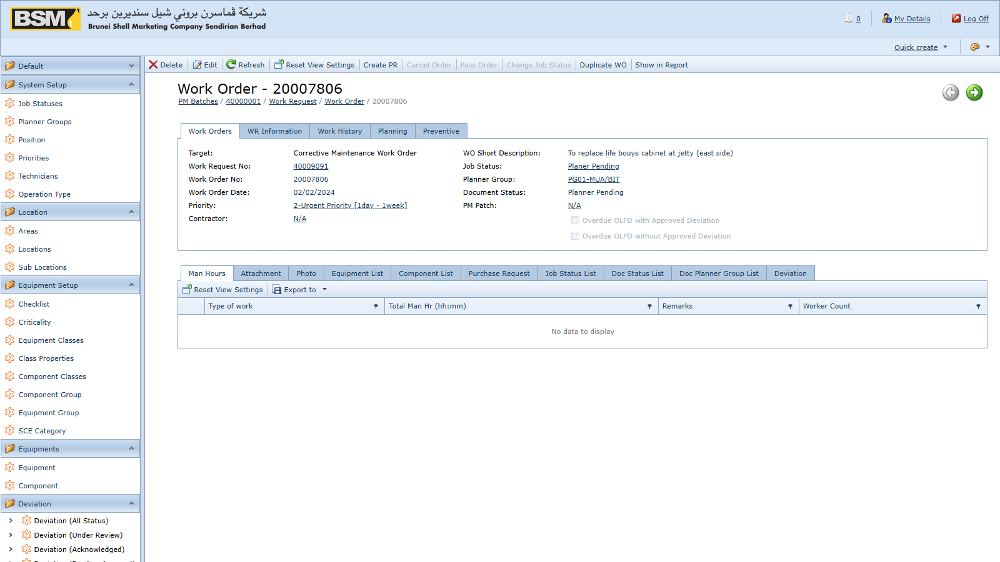

5. Sets the **Plan Date** (requires the **WOPlanDateRole** role).
6. Saves. The WO moves to the next Job Status.

### 7.4 Executing a Work Order

The assigned Supervisor and Technicians:

1. Record actual man-hours on the **Man Hours** tab.
2. Upload progress photos and attachments.
3. Raise a **Purchase Request** from the WO if spare parts are needed — see Chapter 8.
4. Update the **Job Status** tab as work progresses.

### 7.5 Key Job Status codes

Job statuses are configurable, but the system always recognises:

- `AP` — initial CM Job Status (Awaiting Planning)
- `AA` — initial PM Job Status (Awaiting Assignment)
- `TC` — closure Job Status (Technical Completion)

Additional codes (for example *In Progress*, *On Hold*, *Waiting Parts*) are defined by your site's administrator.

### 7.6 Deviations on a Work Order

If your WO type is configured as requiring a deviation, you must either:

- Link an approved deviation on the **Deviations** tab, **or**
- Explicitly flag the WO as not requiring a deviation.

The system blocks saving a WO that has both flags set at the same time.

### 7.7 Closing and cancelling

- **Close** — set the job status to `TC`. All mandatory fields configured at your site must be present.
- **Cancel** — requires the **CancelWORole** role. A cancellation reason is recorded.
- **Delete** — blocked. Use Cancel.

---

## 8. Purchase Requests

### 8.1 What a PR is for

A Purchase Request captures a request to procure materials or services needed to execute a Work Order. Approved PRs are **posted to SAP Business One** where procurement is carried out. If SAP posting is disabled at your site (the `B1Post` setting), PRs are tracked in AMS only.

### 8.2 Creating a PR from a Work Order

The preferred path is to raise the PR from its originating Work Order so traceability is preserved.

1. Open the Work Order in detail view.
2. Go to the **Purchase Requests** tab.

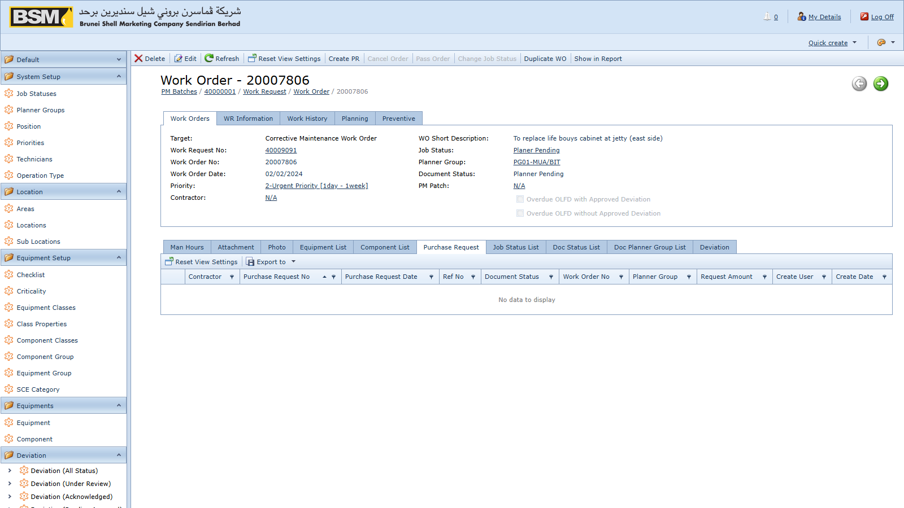

3. Click **+** to add a new PR.
4. Pick a **Contract Document** if this PR is raised against an existing contract — the contract dates are validated against the PR date.
5. On the PR **Detail** tab add line items from the **Item Masters** catalogue with quantities and required dates.
6. Attach quotations under the **Attachments** tab.
7. **Save**. The PR Doc Num is generated.

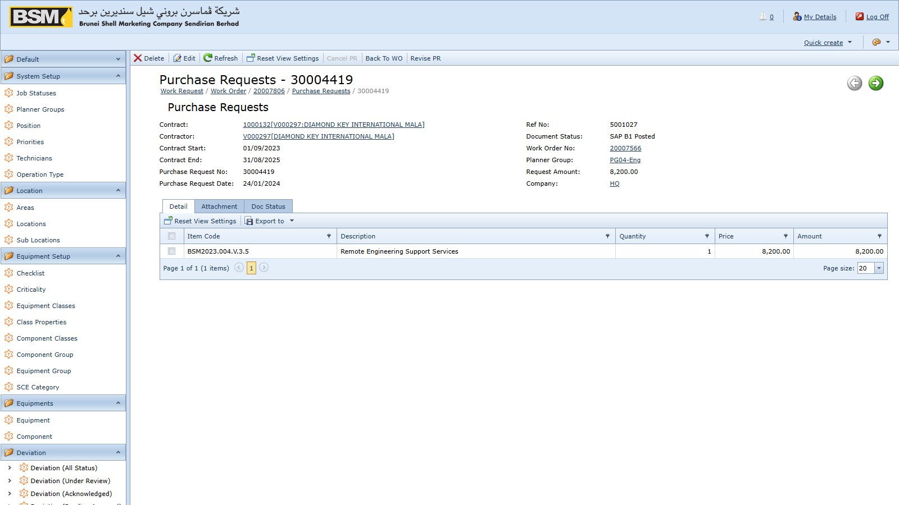

### 8.3 Standalone PRs

You may also create a PR from **Navigation → Purchase Requests → Purchase Requests**, but whenever possible raise it from the originating WO.

### 8.4 Posting a PR to SAP B1

If you have the **PostPR** role:

1. Open an approved PR.
2. Click **Post to SAP** on the toolbar.

3. The system logs in to SAP via the DI API, creates the Purchase Request document, and stores the AMS reference numbers in the SAP user-defined fields.
4. Attachments are copied from AMS into the SAP attachment folder.

If posting fails, the error is shown on screen and logged on the server. The SAP document is not created until a successful post.

### 8.5 Cancelling a PR

With the **CancelPRRole** role you can cancel a PR. If the PR has already been posted to SAP, the SAP document is cancelled as well.

### 8.6 Reconciling with SAP

**Navigation → Purchase Requests → Vw SAP PR** is a read-only mirror of the PRs that exist in SAP. Use it to reconcile AMS against SAP.

---

## 9. Deviations

### 9.1 What a Deviation is for

A Deviation captures an authorised departure from a standard — either an **OLAFD** (Operating Limit And Fixed Deviation) or an **SCE** (Safety Critical Element) deviation. Deviations carry their own approval workflow and can be linked to the Work Orders or Work Requests that depend on them.

### 9.2 Deviation types

- **OLAFD** — operating-limit deviation
- **SCE** — safety critical element deviation

Set the Deviation Type in the header when creating the record.

### 9.3 Creating a Deviation

Deviations are usually created from within the originating WO, WR or PM context by a user with the **DeviationUser** role.

1. On the Deviation screen, select **Company**, **Deviation Type**, **Discipline**, **Location** and **Frequency**.

2. Enter the effective dates and the reason/description.
3. Complete the **Risk Assessment** sub-tabs: Risk to Assets, People, Environment, Community.

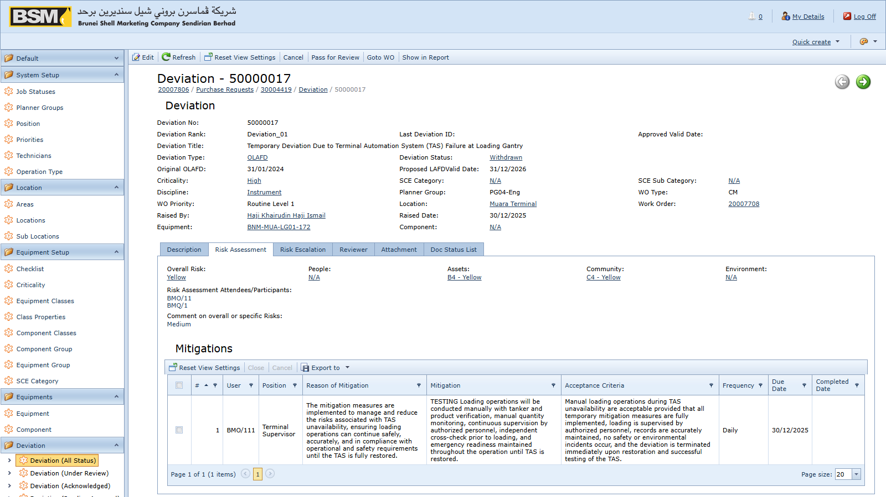

4. Add the required **Reviewers** on the Reviewers tab.
5. Add **Mitigations** on the Mitigations tab.
6. Upload supporting documents under **Attachments**.
7. Save as Draft.

### 9.4 Deviation status flow

A Deviation passes through the following statuses (on the Doc Status tab):

- **New** — freshly created
- **Draft** — being prepared
- **Under Review** — circulated to reviewers
- **Submit Acknowledge** — reviewers have acknowledged
- **Pending Approval** — awaiting Approver sign-off
- **Approved** — approved and in force
- **Open** — currently effective
- **Expired** — effective period ended
- **Draft Extension** — an extension is being prepared
- **Approved Extension** — an extension has been approved
- **Withdrawn** — withdrawn before approval
- **Closed** — formally closed after conclusion
- **Cancel** — cancelled before approval

### 9.5 Who does what

- **DeviationUser** — creates and edits deviations in Draft
- **DeviationReviewer** — reviews and acknowledges in Under Review
- **DeviationManager** — manages portfolio, submits for approval
- **DeviationApprover** — approves in Pending Approval
- **DeviationReopen** — re-opens a Closed deviation

### 9.6 Actions available on a Deviation

The toolbar shows only the actions allowed for your role and the current status:

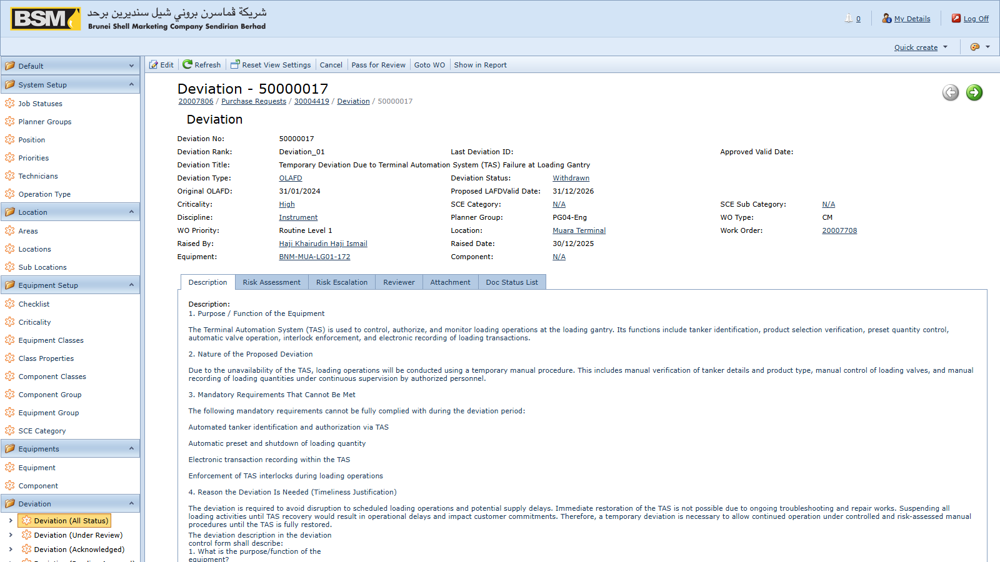

- **Submit for Review** — Draft → Under Review
- **Acknowledge** — reviewer marks review complete
- **Submit for Approval** — Under Review → Pending Approval
- **Approve** — Pending Approval → Approved
- **Withdraw** — withdraw before approval
- **Request Extension** — start a Draft Extension from an Approved deviation
- **Approve Extension** — approve an extension
- **Close** — close an Approved or Expired deviation
- **Reopen** — re-open a Closed deviation (requires DeviationReopen)

> NOTE: New, Link, Unlink and Delete are hidden on the Deviations list — deviations are only created in context from a WO/WR/PM and are never deleted, only cancelled or withdrawn.

### 9.7 Linking a Deviation to a WO or WR

On the Work Order or Work Request detail view, go to the **Deviations** tab and add the deviation there. The system will check the deviation's status when you save the WO/WR.

---

## 10. Reports

### 10.1 Where to find reports

Reports are under **Navigation → Reports**.

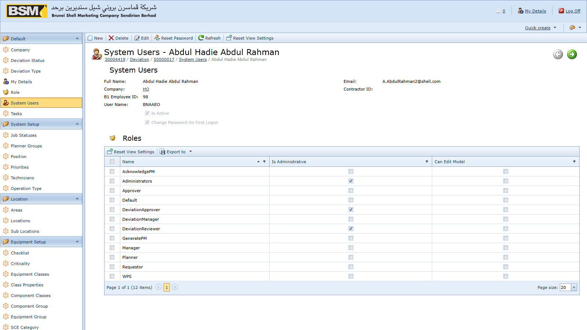

### 10.2 Built-in reports

Reports commonly available:

- **All Work Order Documents** — list of WOs with headers and key fields
- **All Work Request Documents** — list of WRs
- **All PM Patch Documents** — PM patch summary
- **Bad Actor** — equipment with the highest breakdown frequency
- **Weekly AMS Measures** — KPI measures for the current week
- **Monthly KPI Measures** — AI, ME and SCE monthly KPIs
- **Facility / Retail / Terminal Current AMS Measures** — site-scoped KPIs
- **Facility / Retail / Terminal ME Status Report** — mechanical integrity
- **Facility / Retail / Terminal SCE Status Report** — SCE status
- **RETAIL / TERMINAL SCE Deviation LAFD Status Report** — deviation status for SCE items
- **Deviation Layout** — formatted deviation report for distribution

### 10.3 Running a report

1. Click the report name.
2. Enter the parameters in the dialog (typically Company, Date From, Date To, Equipment Class or Discipline).
3. Click **OK** to render the report preview.

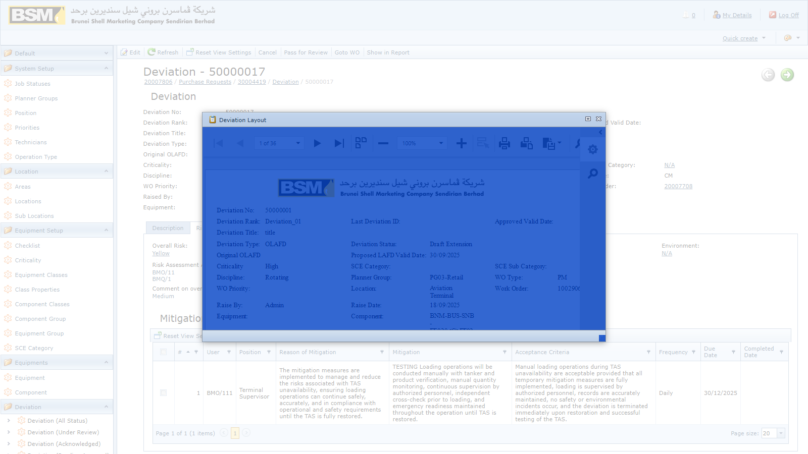

4. Use the preview toolbar to page through, zoom, export or print.

### 10.4 Exporting and printing

The preview supports export to PDF, XLSX, DOCX, MHT, RTF, XLS, CSV, TXT and image formats. For sharing by email, PDF or XLSX are preferred.

### 10.5 Ad-hoc exports from list views

Any list view can be exported without opening a formatted report, using the **Export** toolbar action. This is useful for quick analyses where no formatted report exists.

---

## 11. Tips and troubleshooting

### 11.1 I cannot see a menu I expect

Your role may not include that area. Contact your administrator.

### 11.2 I cannot delete a record

Delete is intentionally blocked on Equipment, Work Orders, Work Requests, PM Schedules and Deviations. Use **Cancel** (WR/WO/PR) or **Withdraw** (Deviation).

### 11.3 I cannot save a Work Order

Read the validation message at the top. The most common causes are:

- No Detail or Component lines
- No source WR (for CM) or source PM Schedule (for PM)
- Both "deviation approved" and "no deviation needed" flags set at once

### 11.4 Posting a PR to SAP fails

Check with your administrator that the SAP B1 settings are correct and that the SAP service is reachable. Your PR remains in AMS unchanged until a successful post.

### 11.5 Dates look wrong

The application forces dates to `dd/MM/yyyy`. Do not change your browser regional settings to work around this — it may break saving.

### 11.6 My layout or filters have disappeared

Layouts are stored per user. If you switched to a different computer and the layout did not follow, use the **Reset** action on the list toolbar to start again.

### 11.7 Getting help

If a screen or action behaves unexpectedly, contact your administrator and provide:

- The Doc Num of the affected document
- The exact error message (or a screenshot)
- The action you were performing

---

## 12. Glossary

- **AMS** — Assets Management System
- **CM** — Corrective Maintenance (breakdown work order)
- **CMMS** — Computerised Maintenance Management System
- **DE** — Deviation document type code
- **Doc Num** — auto-generated document number in the document header
- **Job Status** — the execution status of a WO (for example `AP`, `AA`, `TC`)
- **KPI** — Key Performance Indicator
- **LAFD** — Life-cycle Assurance Failure Deviation
- **MOC** — Management Of Change
- **OLAFD** — Operating Limit And Fixed Deviation
- **PM** — Preventive Maintenance
- **PM Patch** — a named batch of PM Schedules generated together
- **PR** — Purchase Request
- **SAP B1** — SAP Business One, the procurement system AMS posts PRs to
- **SCE** — Safety Critical Element
- **TC** — Technical Completion (closure job status)
- **WR** — Work Request
- **WO** — Work Order

---

*End of End-User Guide.*
